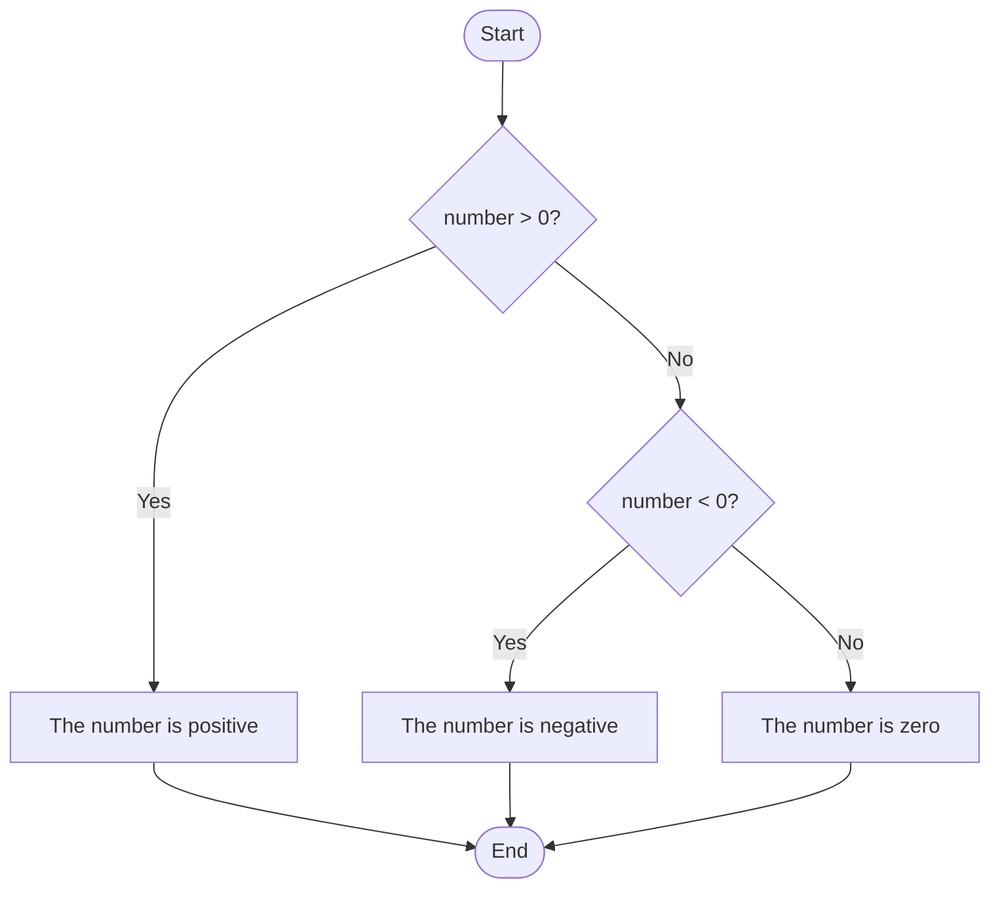
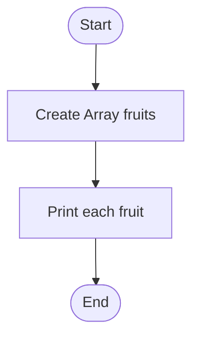

---

# **Control Flow Lab - Beginner's Guide**

### **Lab Duration:** 2 hours  
### **Language:** Java  
### **Prerequisites:** Basic understanding of Java syntax (variables, data types, and methods)

## **Lab Overview**
This lab introduces students to control flow structures in Java, including conditional statements (`if`, `else`, `switch`) and loops (`for`, `while`, `do-while`, `for-each`). Each topic will include an explanation, a coding example, a visual diagram, and a DIY question for practice.

---

## **1. Conditional Statements: `if`, `else`, `else if`**

### **Description:**
Conditional statements allow you to execute specific blocks of code based on a condition.

### **Example:**
```java
public class ControlFlowExample {
    public static void main(String[] args) {
        int number = 10;

        if (number > 0) {
            System.out.println("The number is positive.");
        } else if (number < 0) {
            System.out.println("The number is negative.");
        } else {
            System.out.println("The number is zero.");
        }
    }
}
```

### **Mermaid Diagram:**



### **DIY Question 1:**
Write a Java program that checks whether a given year is a leap year. A year is a leap year if:
- It is divisible by 4.
- But not divisible by 100 unless it is also divisible by 400.

Use `if`, `else if`, and `else` statements.

---

## **2. Switch Statement**

### **Description:**
The `switch` statement allows you to choose from multiple options based on the value of a variable.

### **Example:**
```java
public class SwitchExample {
    public static void main(String[] args) {
        int day = 3;

        switch (day) {
            case 1:
                System.out.println("Monday");
                break;
            case 2:
                System.out.println("Tuesday");
                break;
            case 3:
                System.out.println("Wednesday");
                break;
            case 4:
                System.out.println("Thursday");
                break;
            case 5:
                System.out.println("Friday");
                break;
            default:
                System.out.println("Weekend");
                break;
        }
    }
}
```

### **Mermaid Diagram:**


### **DIY Question 2:**
Write a program that uses a `switch` statement to print the name of a month based on a number (1-12). Use a `default` case to handle invalid inputs.

---

## **3. Loops: `for` Loop**

### **Description:**
`for` loops are used to iterate over a block of code a fixed number of times.

### **Example:**
```java
public class ForLoopExample {
    public static void main(String[] args) {
        for (int i = 1; i <= 5; i++) {
            System.out.println("Iteration: " + i);
        }
    }
}
```

### **Mermaid Diagram:**

```mermaid
flowchart TD
    Start([Start]) --> Init[i = 1]
    Init --> Check{i <= 5?}
    Check -- Yes --> Print[Print "Iteration: i"]
    Print --> Increment[i++]
    Increment --> Check
    Check -- No --> End([End])
```

### **DIY Question 3:**
Create a `for` loop that prints the first 10 even numbers (starting from 2). Hint: Use the condition `i <= 10` and `i += 2` for the increment.

---

## **4. Loops: `for-each` Loop**

### **Description:**
The `for-each` loop is used to iterate over elements in a collection or array.

### **Example:**
```java
public class ForEachExample {
    public static void main(String[] args) {
        String[] fruits = {"Apple", "Banana", "Cherry"};
        for (String fruit : fruits) {
            System.out.println(fruit);
        }
    }
}
```

### **Mermaid Diagram:**



### **DIY Question 4:**
Create a `for-each` loop that iterates over an array of integers and calculates the sum of the array elements.

---

## **5. Continue Statement**

### **Description:**
The `continue` statement skips the current iteration and moves to the next iteration of the loop.

### **Example:**
```java
public class ContinueExample {
    public static void main(String[] args) {
        for (int i = 1; i <= 5; i++) {
            if (i == 3) {
                continue; // Skip this iteration when i is 3
            }
            System.out.println("Iteration: " + i);
        }
    }
}
```

### **Mermaid Diagram:**

```mermaid
flowchart TD
    Start([Start]) --> Init[i = 1]
    Init --> Check{i <= 5?}
    Check -- Yes --> SkipCheck{i == 3?}
    SkipCheck -- Yes --> Continue[Continue to next iteration]
    SkipCheck -- No --> Print[Print "Iteration: i"]
    Continue --> Increment[i++]
    Print --> Increment[i++]
    Increment --> Check
    Check -- No --> End([End])
```

### **DIY Question 5:**
Write a `for` loop that prints numbers from 1 to 10, but skips printing multiples of 3 using a `continue` statement.

---

## **6. Break Statement**

### **Description:**
The `break` statement exits the current loop immediately.

### **Example:**
```java
public class BreakExample {
    public static void main(String[] args) {
        for (int i = 1; i <= 5; i++) {
            if (i == 4) {
                break; // Exit the loop when i is 4
            }
            System.out.println("Iteration: " + i);
        }
    }
}
```

### **Mermaid Diagram:**

```mermaid
flowchart TD
    Start([Start]) --> Init[i = 1]
    Init --> Check{i <= 5?}
    Check -- Yes --> BreakCheck{i == 4?}
    BreakCheck -- Yes --> Exit[Break out of loop]
    BreakCheck -- No --> Print[Print "Iteration: i"]
    Print --> Increment[i++]
    Increment --> Check
    Exit --> End([End])
    Check -- No --> End([End])
```

### **DIY Question 6:**
Create a `while` loop that keeps adding numbers starting from 1, but exits when the sum becomes greater than 20.

---

## **7. Return Statement**

### **Description:**
The `return` statement exits from the method and optionally returns a value.

### **Example:**
```java
public class ReturnExample {
    public static void main(String[] args) {
        int result = addNumbers(5, 3);
        System.out.println("The result is: " + result);
    }

    public static int addNumbers(int a, int b) {
        return a + b; // Exit and return the sum of a and b
    }
}
```

### **Mermaid Diagram:**

```mermaid
flowchart TD
    Start([Start]) --> Call[Call addNumbers(5, 3)]
    Call --> Return[Return the sum]
    Return --> Output[Output the result]
    Output --> End([End])
```

### **DIY Question 7:**
Write a program that uses a `return` statement to check if a number is prime. If the number is not prime, return immediately from the method with a message.

---
