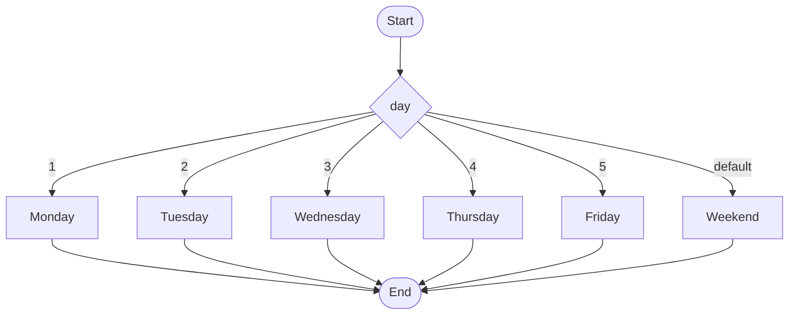
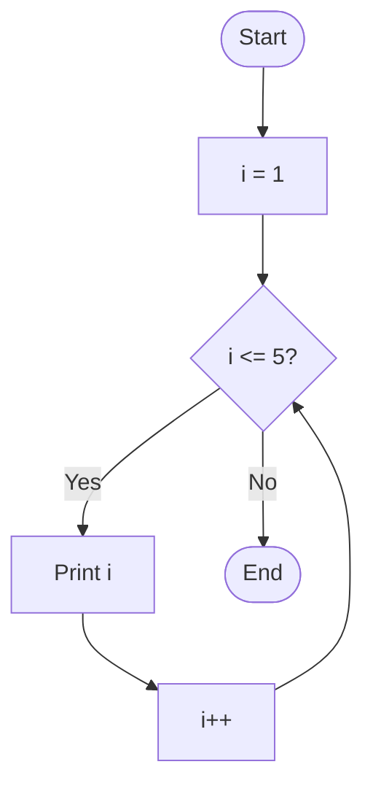
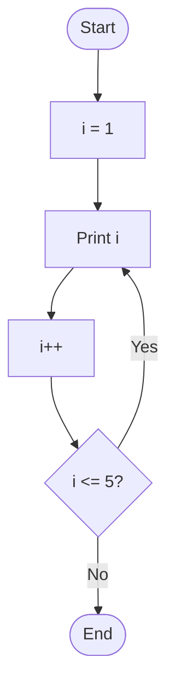
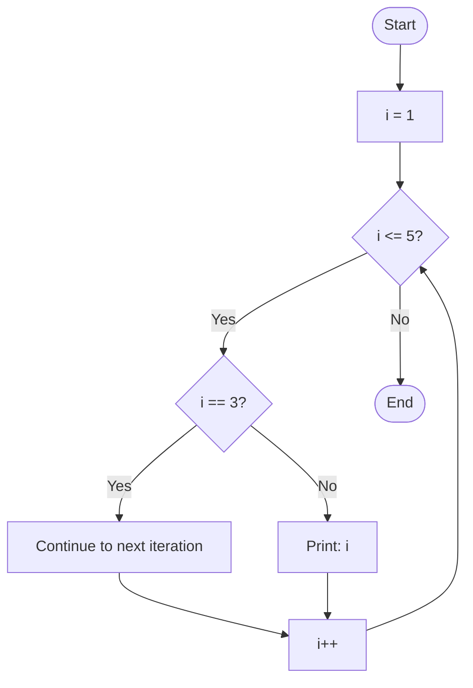
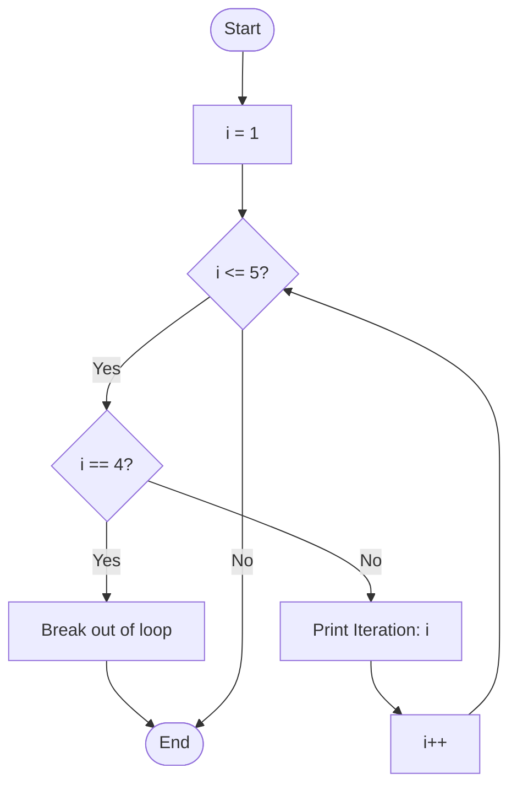
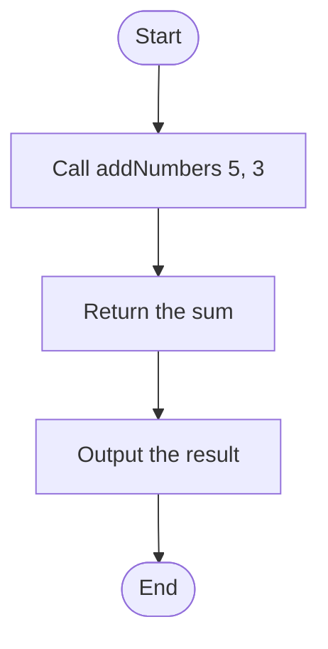

[](https://classroom.github.com/open-in-codespaces?assignment_repo_id=16327114)
---

# **Control Flow Lab - Beginner's Guide**

### **Lab Duration:** 2 hours  
### **Language:** Java  
### **Prerequisites:** Basic understanding of Java syntax (variables, data types, and methods)

## **Lab Overview**
This lab introduces students to control flow structures in Java, including conditional statements (`if`, `else`, `switch`) and loops (`for`, `while`, `do-while`, `for-each`). Each topic will include an explanation, a coding example, a visual diagram, and a DIY question for practice. To start create a package called `ie.atu.controlflow`. After you complete each section commit and sync your code.  

---

## **1. Conditional Statements: `if`, `else`, `else if`**

### **Description:**
Conditional statements allow you to execute specific blocks of code based on a condition.

### **What is happening in the example?**
In the example below, the program checks if the value of the variable `number` is positive, negative, or zero. If `number > 0`, it prints "The number is positive." If `number < 0`, it prints "The number is negative." If neither condition is true, it prints "The number is zero."

### **Example:**
```java
public class ControlFlowExample {
    public static void main(String[] args) {
        int number = 10;

        if (number > 0) {
            System.out.println("The number is positive.");
        } else if (number < 0) {
            System.out.println("The number is negative.");
        } else {
            System.out.println("The number is zero.");
        }
    }
}
```

### **Diagram:**


### **DIY Question 1:**
Write a Java program that checks whether a given year is a leap year. A year is a leap year if:
- It is divisible by 4.
- But not divisible by 100 unless it is also divisible by 400.

Use `if`, `else if`, and `else` statements.

---

## **2. Switch Statement**

### **Description:**
The `switch` statement allows you to choose from multiple options based on the value of a variable.

### **What is happening in the example?**
In the example below, the `switch` statement checks the value of the variable `day`. Depending on its value (1-5), it prints the corresponding weekday name. If `day` is not between 1 and 5, it defaults to printing "Weekend".

### **Example:**
```java
public class SwitchExample {
    public static void main(String[] args) {
        int day = 3;

        switch (day) {
            case 1:
                System.out.println("Monday");
                break;
            case 2:
                System.out.println("Tuesday");
                break;
            case 3:
                System.out.println("Wednesday");
                break;
            case 4:
                System.out.println("Thursday");
                break;
            case 5:
                System.out.println("Friday");
                break;
            default:
                System.out.println("Weekend");
                break;
        }
    }
}
```

### **Diagram:**



### **DIY Question 2:**
Write a program that uses a `switch` statement to print the name of a month based on a number (1-12). Use a `default` case to handle invalid inputs.

---

## **3. Loops: `for` Loop**

### **Description:**
`for` loops are used to iterate over a block of code a fixed number of times.

### **What is happening in the example?**
The example below initializes `i` to 1. As long as `i` is less than or equal to 5, the loop prints the value of `i` and then increments `i` by 1. This process repeats until the condition (`i <= 5`) is no longer true.

### **Example:**
```java
public class ForLoopExample {
    public static void main(String[] args) {
        for (int i = 1; i <= 5; i++) {
            System.out.println("Iteration: " + i);
        }
    }
}
```

### **Diagram:**



### **DIY Question 3:**
Create a `for` loop that prints the first 10 even numbers (starting from 2). Hint: Use the condition `i <= 10` and `i += 2` for the increment.

---

## **4. Loops: `for-each` Loop**

### **Description:**
The `for-each` loop is used to iterate over elements in a collection or array.

### **What is happening in the example?**
The example below initializes an array `fruits` with three values: "Apple", "Banana", and "Cherry". The `for-each` loop iterates through each element of the array and prints the current fruit.

### **Example:**
```java
public class ForEachExample {
    public static void main(String[] args) {
        String[] fruits = {"Apple", "Banana", "Cherry"};
        for (String fruit : fruits) {
            System.out.println(fruit);
        }
    }
}
```

### **Diagram:**


### **DIY Question 4:**
Create a `for-each` loop that iterates over an array of integers and calculates the sum of the array elements.

---

## **5. Loops: `do-while` Loop**

### **Description:**
The `do-while` loop is similar to the `while` loop, but it guarantees that the block of code will be executed at least once. The loop's condition is evaluated **after** the code is executed.

### **What is happening in the example?**
The example below initializes `i` to 1 and prints `i`. After printing, it increments `i` by 1. Then, the loop checks whether `i <= 5`. As long as the condition is true, it repeats the process. This ensures the loop runs at least once, even if `i` starts out greater than 5.

### **Example:**
```java
public class DoWhileExample {
    public static void main(String[] args) {
        int i = 1;

        do {
            System.out.println("Iteration: " + i);
            i++;
        } while (i <= 5);
    }
}
```

### **Diagram:**



### **DIY Question 5:**
Create a `do-while` loop that prints numbers from 10 down to 1.

---

## **6. Continue Statement**

### **Description:**
The `continue` statement skips the current iteration and moves to the next iteration of the loop.

### **What is happening in the example?**
In the example below, the `for` loop prints numbers from 1 to 5. However, when `i` is equal to 3, the `continue` statement skips the print statement and moves to the next iteration.

### **Example:**
```java
public class ContinueExample {
    public static void main(String[] args) {
        for (int i = 1; i <= 5; i++) {
            if (i == 3) {
                continue; // Skip this iteration when i is 3
            }
            System.out.println("Iteration: " + i);
        }
    }
}
```

### **Diagram:**



### **DIY Question 6:**
Write a `for` loop that prints numbers from 1 to 10, but skips printing multiples of 3 using a `continue` statement.

---

## **7. Break Statement**

### **Description:**
The `break` statement exits the current loop immediately.

### **What is happening in the example?**
In the example below, the loop prints numbers from 1 to 5. However, when `i` equals 4, the `break` statement terminates the loop, so numbers after 3 are not printed.

### **Example:**
```java
public class BreakExample {
    public static void main(String[] args) {
        for (int i = 1; i <= 5; i++) {
            if (i == 4) {
                break; // Exit the loop when i is 4
            }
            System.out.println("Iteration: " + i);
        }
    }
}
```

### **Diagram:**



### **DIY Question 7:**
Create a `while` loop that keeps adding numbers starting from 1, but exits when the sum becomes greater than 20.

---

## **8. Return Statement**

### **Description:**
The `return` statement exits from the method and optionally returns a value.

### **Example:**
```java
public class ReturnExample {
    public static void main(String[] args) {
        int result = addNumbers(5, 3);
        System.out.println("The result is: " + result);
    }

    public static int addNumbers(int a, int b) {
        return a + b; // Exit and return the sum of a and b
    }
}
```

### **Mermaid Diagram:**



### **DIY Question 8:**
Write a program that uses a `return` statement to check if a number is prime. If the number is not prime, return immediately from the method with a message.

---
